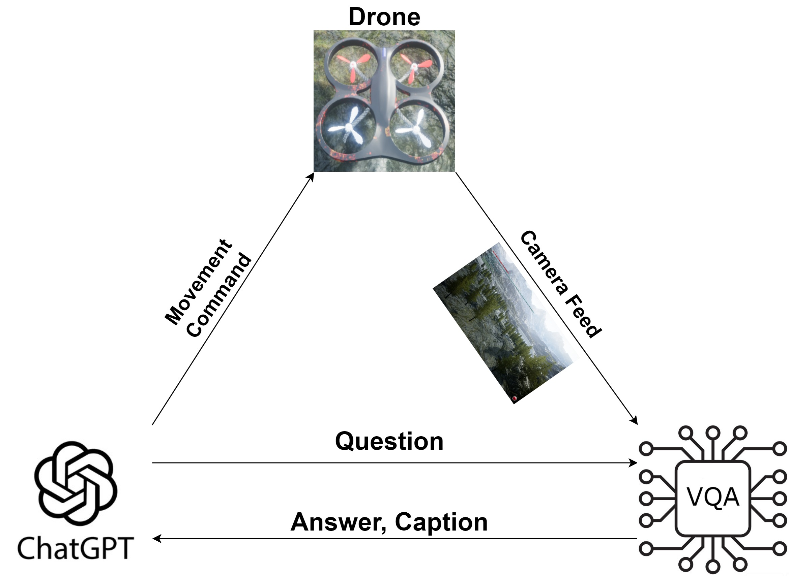
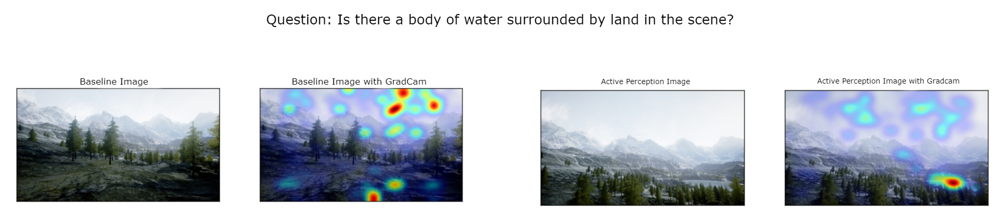
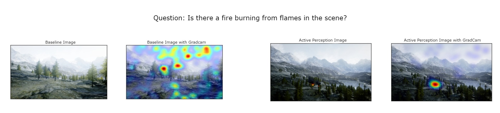

# Large Models in Dialogue for Active Perception and Anomaly Detection

This work presents a method where two deep learning models engage in dialogue to control a drone in real time and improve anomaly detection accuracy. Specifically, an LLM asks questions while guiding the drone through the scene, implementing active perception and a VQA model answers the questions while providing informative captions and explainable attention maps.

## Abstract

Autonomous aerial monitoring is an important task aimed at gathering information from areas that may not be easily accessible by humans. At the same time, this task often requires recognizing anomalies from a significant distance and/or not previously encountered in the past. In this paper, we propose a novel framework that leverages the advanced capabilities provided by Large Language Models (LLMs) to actively collect information and perform anomaly detection in novel scenes. To this end, we propose an LLM-based model dialogue approach, in which two deep learning models engage in a dialogue to actively control a drone to increase perception and anomaly detection accuracy. 
We conduct our experiments in a high fidelity simulation environment where an LLM is provided with a predetermined set of natural language movement commands mapped into executable code functions. Additionally, we deploy a multimodal Visual Question Answering (VQA) model charged with the task of visual question answering and captioning. By engaging the two models in conversation, the LLM asks exploratory questions while simultaneously flying a drone into different parts of the scene, providing a novel way to implement active perception.  By leveraging LLM's reasoning ability, we output an improved detailed description of the scene going beyond existing static perception approaches. In addition to information gathering, our approach is utilized for anomaly detection within the surveillance environment and our results demonstrate the system's effectiveness in informing and alerting about potential hazards.

## Software Implementation
<div align="center">
  
</div>

All the experiments were conducted using the [AirSim](https://github.com/microsoft/AirSim) simulation environment. Our work is inspired by the [ChatGPT for Robotics](https://www.microsoft.com/en-us/research/group/autonomous-systems-group-robotics/articles/chatgpt-for-robotics/) paper and builds upon their established [framework](https://github.com/microsoft/PromptCraft-Robotics). For the LLM, we employed the GPT3.5 model using the [OpenAI API](https://platform.openai.com). For the VQA model, we used the [PnP VQA framework](https://arxiv.org/abs/2210.08773) found inside the `\llm-vqa_dialogue\lavis\models\pnp_vqa_models`.

## Getting Started

- Set up the conda environment  
```
conda env create -f environment.yml
```
- Activate the environment and install the AirSim client.
```
conda activate llm-vqa
pip install airsim
```
- Set up an API key by visiting https://platform.openai.com/account/api-keys. Copy the API key and paste it in the `OPENAI_API_KEY` field of `config.json`.

## Running the experiment
- Download one of the environment rar files from [Releases](https://github.com/Tzoulio/Large_Models_Dialogue_for_Active_Perception/releases) and unzip the package. Run the executable file inside the folder. (The drone settings are inside the `\Environment_name\Binaries\Win64` directory for any possible changes).
- Run `python llm-vqa_dialogue.py` after opening the simulation environment to execute our framework.
- To get the image-caption matching score, add the baseline caption, the proposed caption and the saved position list inside the `test_scores.py` script and run `python test_scores.py` while the simulation environment is running.
- To influence the GPT controller and explore different behaviors, edit the `rules_prompt.txt` and `example_prompt.txt` files by adding or removing information on the prompts.

## Results 

### Average image-caption score
| **Environment**   | **Baseline** | **Proposed** |
|-------------------|--------------|--------------|
|Mountain Landscape |0.384         |**0.585**     |
|Public Square      |0.361         |**0.699**     |
|Snow Road          |0.458         |**0.629**     |
|Lake               |0.451         |**0.690**     |

### Anomaly detection accuracy
| **Method**        | **Environment**  | **Anomaly Detection Score** |
|-------------------|------------------|-----------------------------|
|Baseline           |Mountain Landscape|0.53                         |
|Proposed           |Mountain Landscape|**0.90**                     |
|Baseline           |Public Square     |0.43                         |
|Proposed           |Public Square     |**0.73**                     |
|Baseline           |Lake              |0.26                         |
|Proposed           |Lake              |**0.76**                     |
|Baseline           |Snow              |0.20                         |
|Proposed           |Snow              |**0.83**                     |





## License

All source code is made available under the MIT license.

## Reference
The code provided in this repository accompanies our paper published in ICPR 2024.
If you use this code in your work, please cite the following paper:

<pre>
@inproceedings{chamiti2025large,
  title={Large models in dialogue for active perception and anomaly detection},
  author={Chamiti, Tzoulio and Passalis, Nikolaos and Tefas, Anastasios},
  booktitle={International Conference on Pattern Recognition},
  pages={371--386},
  year={2024},
}
</pre>

## Acknowledgments

The work presented here is supported by the RoboSAPIENS project funded by the European Commission’s Horizon Europe programme under grant agreement number 101133807. This publication reflects the authors’ views only. The European Commission is not responsible for any use that may be made of the information it contains.

<p align="center">

</p>
<p align="center">
Learn more about <a href="https://robosapiens-eu.tech/">RoboSAPIENS</a>.
</p>
<p align="center">
     
</p>

